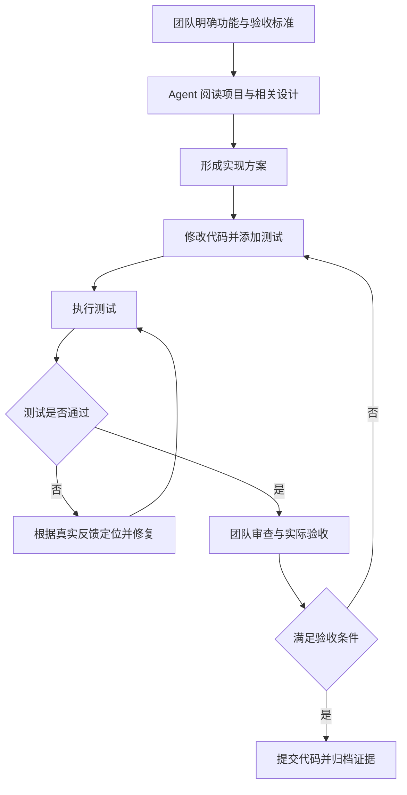

# FXXX：开发 Trajectory

状态：示意模板，不是已完成任务的过程证据。请按真实过程修改节点，删除未发生的步骤，并补充对应日志和测试记录。

```mermaid
flowchart TD
    A[团队明确功能与验收标准] --> B[Agent 阅读项目与相关设计]
    B --> C[形成实现方案]
    C --> D[修改代码并添加测试]
    D --> E[执行测试]
    E --> F{测试是否通过}
    F -- 否 --> G[根据真实反馈定位并修复]
    G --> E
    F -- 是 --> H[团队审查与实际验收]
    H --> I{满足验收条件}
    I -- 否 --> D
    I -- 是 --> J[提交代码并归档证据]
```

- 对应 Feature：待填写链接。
- 对应开发日志与步骤：待填写。
- 测试报告：待填写链接。
- Commit ID：待提交后填写。
